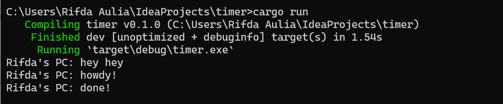
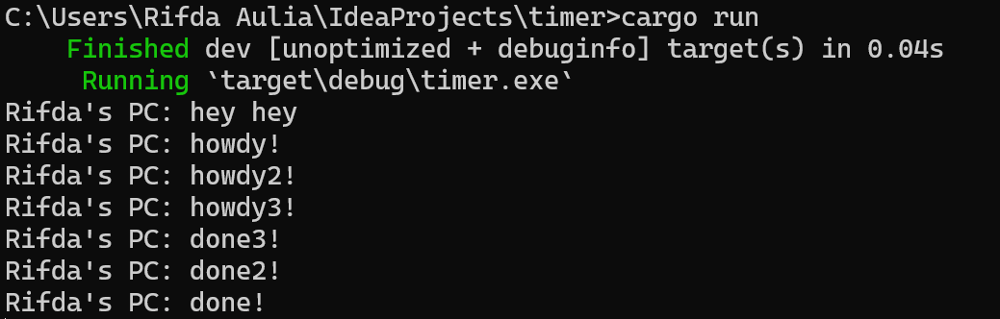

**1.2. Understanding how it works.**  

  
Dari hasil pengamatan output, dapat kita pahami bahwa fungsi async akan dijalankan di luar dari fungsi utama yang memanggilnya. Sehingga, "hey hey" bisa saja ditampilkan lebih dulu sebelum "howdy!" dan "done!" karena "hey hey" berada di luar fungsi async. Fungsi tersebut akan melanjutkan eksekusi program dan menjalankan `println!("hey hey");` sementara fungsi async masih menunggu hasil dari future.

**1.3. Multiple Spawn and removing drop**  

 

Dari output yang dihasilkan, dapat dilihat bahwa keberadaan banyak spawner menyebabkan lebih banyak tugas yang harus dilakukan karena lebih banyak tugas yang diantrikan ke task sender yang berfungsi seperti antrian pesan. Tidak menutup spawner menyebabkan program tidak pernah berhenti karena program menganggap bahwa masih akan ada transmisi data oleh spawner. drop(spawner) sendiri adalah indikasi bahwa interaksi telah selesai dan spawner akan ditutup. Ketika spawner memanggil fungsi spawn, ia akan membuat tugas baru yang dialirkan ke task sender. Executor akan mengambil satu tugas dari task sender dan mengeksekusinya dan setelah itu mengambil tugas lain hingga tugas habis dan spawner dijatuhkan yang menunjukkan interaksi telah selesai.